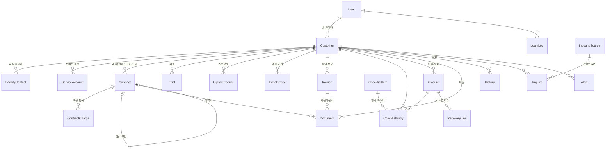

# 늘케어 고객관리 시스템 데이터 모델 (v0.6)

> 기준: 기능정의서 v1.7 · 화면정의서 v1.2
> v0.6 변경: 갱신 = 종료일 연장, `Contract.autoRenewedFrom` 추가
> v0.5 변경: 문서 버전 보관 없음, 저장 경로 규칙 변경, `Document.title`(추가 자료 서류명) 추가·`etcCategory` 미사용, 항목당 파일 1개
> v0.4 변경: `Contract` 금액 구조 — `contractType`(구축형/구독형), `unitPriceHub·Band·Charger`, `purchasePayment`(일시납/분납)·`purchaseBillingMonth`·`installmentMonths`, `managementFee`·`managementFeeStart`, `joinFee`(가입비, 계약 시작월 1회), `autoRenewMonths` 추가 / `billingTiming`·`qtyAdapter` 삭제
> v0.3 변경: `Customer.meetingDate` 미사용(화면에서 제거, 미팅은 History 수동 기록), 체크리스트 `ChecklistEntry.doneAt` 수정 가능
> v0.2 변경: `CustomerStatus`에서 문의접수(INQUIRY) 제거, 기본값 진행대기(PENDING) / `FacilityContact.isPrimary` 여러 명 가능
> 구현: PostgreSQL(Supabase) + Prisma 7 — 실제 스키마는 `prisma/schema.prisma`
> 표기: 금액은 모두 **공급가(원, 정수)** 저장, VAT 포함 금액은 화면에서 계산

---

## 1. 전체 구조 (ERD)

---

## 2. 테이블 요약

| 영역 | 테이블 | 역할 | 비고 |
|---|---|---|---|
| 사용자 | `User` | 내부 사용자 (관리자/일반) | id = Supabase Auth id, 삭제 없음(isActive), 이메일·이름 변경 불가, mustChangePassword = 임시 비밀번호 상태 |
| | `LoginLog` | 로그인 기록 | 성공·실패, IP, 브라우저 |
| 고객사 | `Customer` | 고객사 기본·사업자·정산·설치환경·서비스 URL·도입 일정 | 1:1 정보는 한 테이블에 모음 |
| | `FacilityContact` | 시설 담당자(복수) | isPrimary = 대표 담당자(실무·주 소통), 여러 명 가능·1명 이상 |
| | `ServiceAccount` | 발급한 늘케어 계정 | 유형은 기록용, 비밀번호 선택·암호화 |
| 계약 | `Contract` | 계약 (현재 1건 + 이전 계약 보관) | 유형(구축형/구독형)·제공 장비(허브·밴드·충전기)·단가·납부·관리비·자동연장 기간·갱신 상태 |
| | `ContractCharge` | 직접 추가 비용 (구축비·기타 장비비 등, 일시/월) | 일시는 청구월 보유, 계약 금액은 Contract에 |
| | `Trial` | 체험 기간·체험 장비 수량·결과 | |
| | `OptionProduct` | 태블릿·TV 등 옵션상품 | 일시/월 비용, 무상 가능 |
| | `ExtraDevice` | 분실·파손·증설 추가 기기 | 무상 가능 |
| 청구 | `Invoice` | 고객사 × 월 청구 건 | 생성 시점 금액·내역 스냅샷, CMS 필드 예약 |
| 체크리스트 | `ChecklistItem` | 항목 마스터 (도입 11 + 종료 4) | 항목 추가 대비 |
| | `ChecklistEntry` | 고객사별 체크 상태 | 완료일·완료자 |
| | `Closure` | 미전환·종료·해지 시 생성되는 회수·종료 묶음 | |
| | `RecoveryLine` | 기기별 제공/회수 수량 | |
| 문서 | `Document` | 모든 업로드 파일 (슬롯 8종) | 버전 관리(groupId + version) |
| 기록 | `History` | 자동·수동 히스토리 | 자동은 수정 불가 |
| 인바운드 | `InboundSource` | 문의 수신 경로(구글폼별 — 세일즈팀 폼 등) | token = 구글폼 스크립트 연결 코드, mapping = 질문 제목 → 문의 항목, 기본 내부 담당자 |
| | `Inquiry` | 채널별 문의 | externalId(경로id:응답id)로 중복 수신 방지, sourceId·규모(scale)·제외 사유, raw에 원본 답변 보관 |
| 알림·설정 | `Alert` | 알림 (배치 생성·자동 해제) | dedupeKey로 중복 방지 |
| | `Setting` | 알림 기준 일수 등 설정값 | key-value |

---

## 3. 주요 설계 결정

### 3-1. 상태·계약
- **고객사 상태**는 `Customer.status` 한 곳에만 저장, 변경 시 `History`에 이전→이후 기록
- 고객사는 **진행대기(PENDING)로 시작** (직접 등록·인바운드 문의 전환 공통). 문의접수 단계는 `Inquiry.status = NEW`(미처리)가 담당
- **현재 계약**: `Contract.state = CURRENT` 1건 (앱에서 보장). **갱신은 현재 계약의 `endDate`를 늘림**(새 계약 생성 안 함, 2026-10-02) — `PAST`·`previousId`는 이전 데이터 호환용
- **갱신 배지는 저장하지 않고 계산**

| 배지 | 판단 조건 |
|---|---|
| 갱신 확인 필요 | 사용중 + 현재 계약 종료일 ≤ 오늘 + 설정일수(60) + 갱신 취소 아님 |
| 갱신 취소됨 | 현재 계약 `renewalCancelled = true` |
| 자동연장 미승인 | 현재 계약 `autoRenewedFrom`(자동연장 전 종료일) 있음 — 승인·직접 종료일 변경 시 비움 |

- 자동연장 후 **[계약 종료로 변경]**: `endDate`를 `autoRenewedFrom`으로 되돌리고 그 날짜로 계약종료 처리

### 3-2. 금액
- 저장: 공급가 정수 / 표시: VAT 포함 = 공급가 × 1.1 (원 단위 내림)
- **계약 금액**: 구축형 = Σ(장비 단가 × 수량) 일시납 또는 분납(월) / 구독형 = 밴드 월 단가 × 밴드 수(계약 기간 매월) / 가입비 = 계약 시작월 1회 / 관리비 = 시작월부터 매월 — `ContractCharge`는 직접 추가 비용(구축비 등)만
- **비용 줄**: 계약 금액·옵션상품·추가 기기·직접 추가 비용을 `lib/billing.ts`가 비용 줄(일시: 청구월 / 월: 시작~종료월)로 정리
- **월 비용** = 해당 월에 걸리는 월 비용 줄의 합 (저장하지 않고 계산, 리스트·요약은 이번 달 기준)
- **청구 건 예정 금액** = 월 비용 + 해당 월이 청구월인 일시 비용(계약·옵션·추가기기) → 생성 시 `plannedAmount` + `lineItems`에 **스냅샷 저장** (이후 비용이 바뀌어도 지난 청구 금액 유지)

### 3-3. 체크리스트
- 도입 체크리스트: 고객사 등록 시 활성 `ONBOARDING` 항목만큼 `ChecklistEntry` 생성
- 회수·종료: 미전환(체험 후)·계약종료·해지 전환 시 `Closure` + 해당 항목 Entry + `RecoveryLine`(제공 수량 = 계약 + 추가 기기 + 체험 수량) 생성
- 주의: `closureId`가 null인 도입 항목 중복 방지는 **부분 유니크 인덱스**를 마이그레이션 SQL로 추가
  `CREATE UNIQUE INDEX ON "ChecklistEntry"("customerId","itemId") WHERE "closureId" IS NULL;`

### 3-4. 문서
- 파일 본문은 **Supabase Storage(비공개 버킷)**, DB에는 메타정보만
- 버킷 `documents`(비공개, 20MB, PDF·이미지만) — 생성·설정: `npx tsx scripts/setup-storage.ts`
- 경로: `customers/{customerId}/{slot}/{uuid}.{확장자}` (한글 파일명은 저장소 키에서 오류 → 원래 파일명은 `fileName`에 보관, 다운로드 시 원래 이름) · 열람은 만료 링크(signed URL, 2분)
- 업로드: 서버가 1회성 업로드 토큰 발급 → 브라우저가 Storage에 직접 업로드 → 서버가 파일 존재·형식·크기 확인 후 메타정보 저장
- 버전 보관 없음(2026-10-02): 교체 시 기존 행·파일 삭제 후 새 행 추가 (`groupId`·`version`·`isLatest` 컬럼은 남아 있으나 항상 1건·최신)
- 사용중 전환 검사: `CONTRACT`(현재 계약 연결) + `DEVICE_RECEIPT`의 최신본 존재 여부

### 3-5. 민감정보
- 와이파이 비밀번호·서비스 계정 비밀번호: **앱에서 AES-GCM 암호화** 후 저장, 키는 환경변수(`ENCRYPTION_KEY`)
- 조회([보기]) 시 `History`에 조회 기록, 엑셀 내보내기 제외
- 입소자 명단 다운로드도 `History` 기록

### 3-6. 동시 편집
- 편집 가능한 테이블에 `version` 컬럼 → 저장 시 `WHERE id = ? AND version = ?`로 갱신, 0건이면 충돌 모달
- 히스토리 기록·체크·파일 업로드·항목 추가는 충돌 검사 없음

### 3-7. 알림
- 매일 배치가 조건을 검사해 `Alert` 생성, 조건이 해소되면 `resolvedAt` 기록
- 구현: `src/lib/alerts.ts` (`computeAlerts` → `syncAlerts`), 같은 알림이 다시 생기면 `resolvedAt`을 비우고 `createdAt`을 갱신(새 알림으로 표시)
- `dedupeKey`(유형:대상:단계)로 같은 알림 중복 생성 방지 (예: D-60 주황 → 경과 빨강은 별도)
- **새 알림** = `User.alertsSeenAt` 이후 생성된 미해제 알림 (🔔 모달 열면 갱신) — 수신자 구분 없음

### 3-8. 이관 데이터
- `Contract.origin = MIGRATION`, `History.actorId = null` + 내용 "엑셀 이관"
- 체크리스트 완료자 없음(`doneById = null`) → 화면에 "이관"으로 표시

---

## 4. 배치 작업 (Vercel Cron → API)

> Vercel Cron은 UTC 기준. 매일 00:10 KST = `10 15 * * *` (UTC 전날 15:10)

| 주기 | 작업 |
|---|---|
| 매일 00:10 KST | ① 갱신 취소·자동연장 N 건 종료일 경과 → 계약종료 전환 + Closure 생성 ② 미조치 건 종료일 경과 → 종료일 자동연장(설정 연장 기간, `autoRenewedFrom` 기록) ③ 사용중 고객사별 해당 월 `Invoice` 생성(이미 있으면 건너뜀) ④ 알림 생성·해제 |
| 2차 | 효성CMS 출금 결과 조회 → `Invoice.status·paidOn·cmsResult` 갱신 |

- 월 청구 건은 "매월 1일" 대신 매일 배치에서 없을 때만 생성 (`@@unique([customerId, billingMonth])`로 중복 방지)
- 모든 시스템 처리는 `History`에 `actorId = null`(시스템)로 기록
- 청구 건 생성: `src/lib/invoice.ts` (`ensureMonthlyInvoices`) — 항목별 내역을 `lineItems`에 생성 시점 값으로 저장
- 구현: `src/lib/daily-batch.ts` ← `/api/cron/daily` (Authorization: Bearer `CRON_SECRET`), `vercel.json` cron `10 15 * * *`·리전 icn1

---

## 5. 앱에서 보장할 규칙 (DB 제약으로 못 거는 것)
- 고객사 코드: 입력 후 변경 불가
- 고객사당 `CURRENT` 계약 1건, 대표 서비스 계정 1개, 시설 담당자 1명 이상, 대표 담당자(`isPrimary`) 1명 이상 (여러 명 가능)
- 상태 전환 시 도착 상태별 필수 항목 검사 (기능정의서 1장 표)
- 자동 히스토리 수정·삭제 불가, 수동 히스토리는 작성자 본인만 수정
- 사용자 삭제 API 없음, `email` 변경 불가

---

## 6. 2차 장비관리 확장 자리 (지금은 만들지 않음)
| 테이블(안) | 내용 |
|---|---|
| `Device` | 장비 개체: 종류, 디바이스 번호(연속 번호), 시리얼, 입고일, 상태(입고완료·서비스중·고장·수리중) |
| `DeviceAssignment` | 장비 ↔ 고객사 매핑 이력 (매핑일·해제일) — 연속 번호 범위 일괄 매핑 |
| `Resident` | 입소자 (이름·성별·입소 위치) ↔ 장비 매핑 |
| `DeviceEvent` | 장비 상태 변경·AS 이력 |

- 1차의 수량 필드(`Contract.qty*`, `ExtraDevice`, `Trial.qty*`, `RecoveryLine`)는 2차에서 **매핑 수량과 대조**하는 기준값으로 계속 사용
